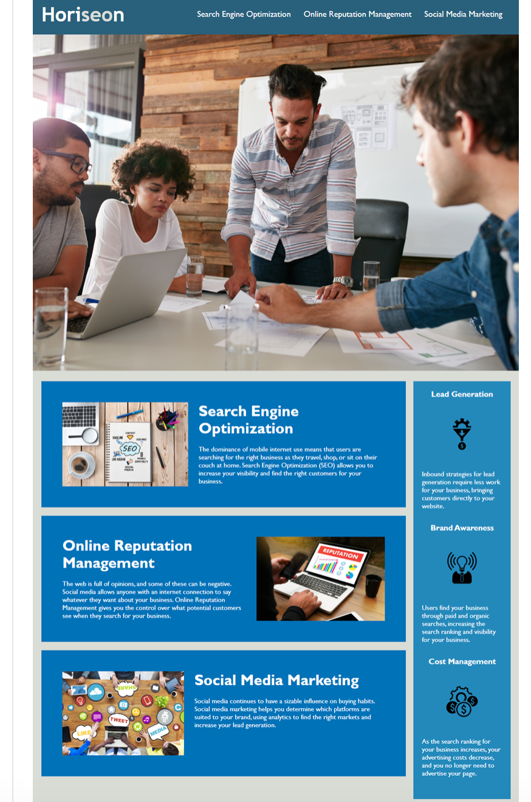
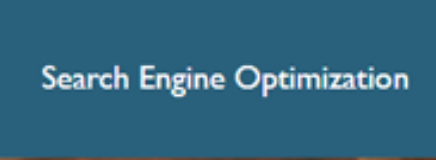
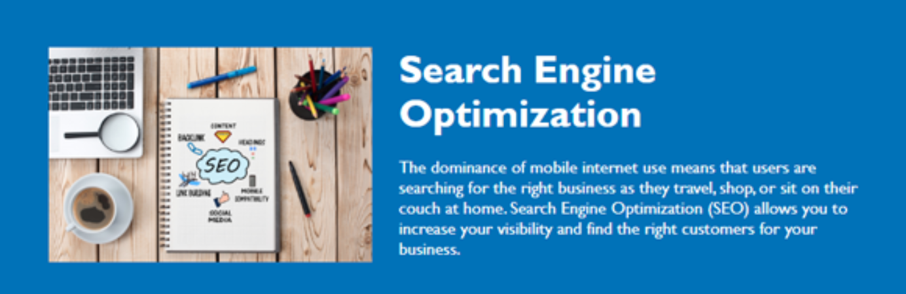
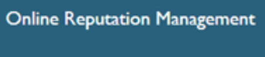
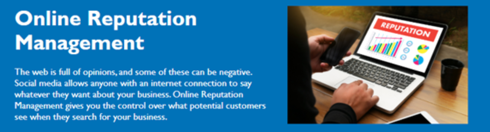
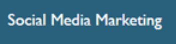
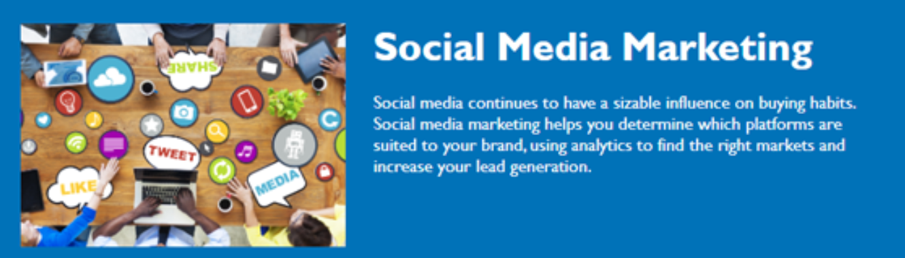

# homework1

**HORISEON - Marketing Agency**

**Credits**

As a marketing agency , Horiseon wanted a code base that follows acessibility standards so that their site is optimized for search engines. 

**Usage**

This marketing website is used to efficiently find the right customers for your business, manage your business online reputation and market yourself on social media. 

The Search Engine Optimization button will redirect you to the lower part of the webpage to further explain how to increase your visibility. 

The Online Reputation Management button will also redirects you to the lower part of the webpage to further explain what customers see when they search your business. 

The Social Media Marketing button also redirects you to the lower part of the webpage to futher explain the impact social media has on your business. 

